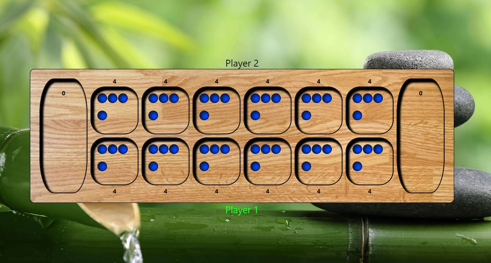

# Mancala

## Table of contents

- [Overview](#overview)
  - [The challenge](#the-challenge)
  - [Screenshot](#screenshot)
  - [Links](#links)
- [My process](#my-process)
  - [Built with](#built-with)
  - [What I learned](#what-i-learned)
  - [Continued development](#continued-development)
  - [Useful resources](#useful-resources)
- [Author](#author)
- [Acknowledgments](#acknowledgments)

## Overview

Tasked with creating a game using React, I choose to build Mancala. It is a two player game, meant to be played on a single computer.

### Screenshot

### Links

- Live Site URL: [https://mikegv.github.io/mancala/](https://mikegv.github.io/mancala/)

## My process

### Built with

- Semantic HTML5 markup
- CSS custom properties
- Flexbox
- [React](https://reactjs.org/) - JS library
- [Styled Components](https://styled-components.com/) - For styles

### What I learned

This project taught me so much about developing a bigger application. While it may not be big compared to other code bases, this was my first large project with React. I built an animation that would start with a user click but then change based on a condition. I also learned how difficult it can start to get keeping track of what props are being passed around between components.

## Author

- Website - [Mike Villa](https://github.com/mikegv)

